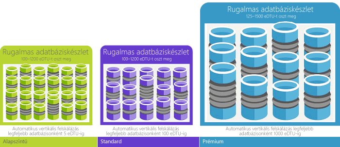

# A Database Transaction Unitok (adatbázisok tranzakciós egységei, DTU-k) és a rugalmas Database Transaction Unitok (eDTU-k) ismertetése
Ez a cikk ismerteti az adatbázis-tranzakciós egységek (dtu-k) és a rugalmas adatbázis-tranzakciós egységek (edtu-k), és mi történik, ha kattint hello maximális Dtu és edtu-k.  

## Mi az a Database Transaction Unit (DTU)?
Egy adott szinten belül egyetlen Azure SQL-adatbázis egy [szolgáltatási rétegben](sql-database-service-tiers.md#single-database-service-tiers-and-performance-levels), a Microsoft biztosítja, hogy az adatbázishoz tartozó erőforrások bizonyos szintű (független bármely más adatbázis hello Azure felhőben lévő) és egy kiszámítható teljesítmény szintje. Ez a mennyiség-erőforrások akkor a program egy adatbázis-tranzakciós egységek vagy dtu-k számát, és kevert méri, Processzor, memória, i/o (adatok és a tranzakciós napló i/o). Ezek az erőforrások között hello arány eredetileg határozza egy [teljesítményteszt OLTP-munkaterhelés](sql-database-benchmark-overview.md) jellemző OLTP-munkaterhelések valós toobe tervezték. A terhelés meghaladja hello bármely ezeket az erőforrásokat, az átviteli sebesség esetén az szabályozottan halmozott – így a lassabb teljesítmény és időtúllépéseket okoz. a számítási feladatok által használt hello erőforrások nincs hatással a hello erőforrások elérhető tooother SQL-adatbázisoknál hello Azure felhőben, és más munkaterhelések által használt hello erőforrás nincs hatással a hello erőforrások elérhető tooyour SQL-adatbázis.

Understanding hello relatív erőforrások mennyisége más-más teljesítménybeli szinten Azure SQL-adatbázisok és a szolgáltatásszintek közötti esetén a leghasznosabb-i nem. Például így dupla hello Dtu hello teljesítményszint szükséges adatbázis növelésével csatlakozás erőforrás elérhető toothat adatbázis toodoubling hello készletét. Például egy 1750 DTU-val rendelkező Prémium P11 adatbázis 350x több DTU számítási teljesítményt nyújt, mint egy 5 DTU-val rendelkező Alapszintű adatbázis.  

hello (DTU) erőforrás-felhasználás részét a munkaterhelésből, használjon mélyebb betekintést toogain [Azure SQL adatbázis-lekérdezési Terheléselemző](sql-database-query-performance.md) számára:

- Leggyakoribb lekérdezések hello azonosíthatja a CPU/időtartama/végrehajtási száma, amely potenciálisan a jobb teljesítmény kell beállítani. Például egy i/o-igényes lekérdezés előnye származhat hello használata [memórián belüli optimalizálási technikákat](sql-database-in-memory.md) toomake jobban használja a rendelkezésre álló memória hello egy bizonyos szolgáltatás szintjén és teljesítményszintet.
- Részletekbe menően tárhatják fel a lekérdezés hello részleteit, és tekintse meg a szöveg- és erőforrás-használat előzményeit.
- Hozzáférés teljesítményhangolás által végrehajtott műveletek megjelenítéséhez javaslatokat [SQL Database Advisor](sql-database-advisor.md).

Is [szolgáltatásszintek módosítása](sql-database-service-tiers.md) (általában átlagolási a négy másodperc) minimális állásidővel tooyour alkalmazással bármikor. Számos vállalkozás és alkalmazás képes toocreate adatbázisok alatt, és nem elegendő, különösen ha használati minták viszonylag jól jelezhetők előre teljesítmény felfelé vagy lefelé az igény szerinti tárcsázás. De ha előre nem látható használati minták, azt teheti, hogy rögzített toomanage költségek és az üzleti modell. Ebben a forgatókönyvben egy rugalmas készlet edtu-k között hello készletben több adatbázis oszt meg egy bizonyos mennyiségű használja.

## Mi az a rugalmas Database Transaction Unit (eDTU)?
Ahelyett, hogy adjon meg egy dedikált erőforrások (dtu-k) tooa SQL-adatbázis, amely mindig elérhető, függetlenül attól, hogy nem szükséges, mint elhelyezheti az adatbázisok egy [rugalmas készlet](sql-database-elastic-pool.md) egy SQL-kiszolgálón osztja meg az erőforrásokat között ezen adatbázis. hello megosztott erőforrások rugalmas adatbázis-tranzakciós egységek vagy edtu-k által mért rugalmas készlethez. Rugalmas készletek egyszerű költséghatékony megoldást nyújt toomanage hello Teljesítménycélok több adatbázisok esetén, amelyek jelentősen eltérő és előre nem látható használati minták. A rugalmas készletekben található garantálható, hogy egy adatbázis hello erőforrásokat használ hello készletben, továbbá, hogy a minimális erőforrások mérete mindig elérhető tooa adatbázis rugalmas készlethez. Lásd: [rugalmas készletek](sql-database-elastic-pool.md) további információt.

Egy készlethez egy adott számú eDTU tartozik, amelyek egy adott áron vehetők igénybe. Hello rugalmas készlet, belül az egyes adatbázisok adta hello rugalmasságot tooauto méretű hello beállított határain belül. Túl nagy terhelés alatt egy adatbázis által felhasználható további edtu-k toomeet igény szerinti, amíg könnyű terhelések tartozó adatbázisok felhasználásához kisebb be, hogy nincs terhelés adatbázisok felhasználásához nincs edtu-k toohello pont. Úgy hello teljes készlet erőforrásait, helyett adatbázisonként, felügyeleti feladatok egyszerűsítettek, és egy előre jelezhető költségvetési hello készlet rendelkezik.

További edtu-k hello adatbázisok hello készletben meglévő készlet tooan adatbázis állásidő nélkül, és az ne legyen hatással lehet hozzáadni. Ugyanígy ha az eDTU-kra már nincs szükség, bármikor el is távolíthatók a meglévő készletekből. Adhat hozzá vagy adatbázisok toohello készletbe vonni, illetve más adatbázisok edtu / adatbázis hello keretösszege használhatja edtu-k tooreserve túl nagy terhelés alatt. Ha egy adatbázis van kiszámítható alatt-okhoz erőforrásokat, akkor is vegye ki hello készlet és a szükséges erőforrások kiszámítható mennyiségű egyetlen adatbázis.

## Hogyan lehet eldönteni, hogy a munkaterhelés szerint szükséges dtu-inak száma hello?
Ha egy meglévő helyszíni toomigrate vagy SQL Server virtuális gép munkaterhelés tooAzure SQL-adatbázis, használhatja a hello [DTU Kalkulátorával](http://dtucalculator.azurewebsites.net/) szükséges dtu-inak száma tooapproximate hello. Egy meglévő Azure SQL Database-munkaterhelés használható [SQL adatbázis-lekérdezési Terheléselemző](sql-database-query-performance.md) toounderstand az adatbázis erőforrás felhasználás (dtu-k) tooget mélyebb betekintést hogyan toooptimize a terhelést. Is használhatja a hello [sys.dm_db_ resource_stats](https://msdn.microsoft.com/library/dn800981.aspx) DMV tooget hello erőforrás felhasználási adatok hello az elmúlt egy óra. Másik lehetőségként hello katalógusnézet használatával derítheti ki [sys.resource_stats](http://msdn.microsoft.com/library/dn269979.aspx) is is lehet lekérdezett tooget hello ugyanazok az adatok hello elmúlt 14 napban, annak ellenére, 5 perces átlagok alacsonyabb rögzített.

## Honnan tudom, hogy hasznát venném-e egy rugalmas erőforráskészletnek?
A készleteket nagy számú, speciális felhasználási mintákkal rendelkező adatbázishoz tervezték. Az egyes adatbázisok mintáit átlagosan alacsony, és viszonylag rendszertelen időközönkénti hirtelen megugró kihasználtság jellemzi. SQL-adatbázis automatikusan hello korábbi erőforrás-kihasználtságának megtekintéséhez meglévő SQL adatbázis-kiszolgáló adatbázisának kiértékeli, és azt javasolja, hogy a megfelelő tárolókészlet konfigurációját hello hello Azure-portálon. További információkért lásd: [Mikor érdemes rugalmas készletet használni?](sql-database-elastic-pool.md)

## Mi történik, ha elérem a DTU-k maximális számát?
Teljesítményszintet kalibrálni vannak, és az irányadó tooprovide hello szükséges erőforrások toorun a adatbázis munkaterhelést másolatot toohello a kiválasztott szolgáltatási szint/teljesítménye szint megengedett maximális határokon. Ha a terhelést van elérte-e valamelyik Processzor/adat IO/Log IO korlátok hello korlátok, tooreceive hello erőforrások hello maximális engedélyezett szinten továbbra is, de nagyobb valószínűséggel toosee késések fordulnak elő a lekérdezések. Ezek a korlátozások nem eredményeznek ki a hibákat, de ahelyett, hogy lassulást hello munkaterhelés, hacsak hello lassulást el, hogy lekérdezések indulnak időzítési súlyos. Ha az egyidejű felhasználói munkamenetek/lekérések (munkaszálak) száma eléri a maximálisan engedélyezett korlátot, explicit hibaüzenetek jelennek meg. További információk a processzoron, a memórián, illetve az adat- és naplóátvitelen kívüli egyéb erőforrásokra vonatkozó korlátokkal kapcsolatban az [Azure SQL Database resource limits](sql-database-resource-limits.md) (Az Azure SQL Database erőforráskorlátai) cikk tartalmaz további információt.

## Következő lépések
* Lásd: [szolgáltatásréteg](sql-database-service-tiers.md) hello Dtu és edtu-k érhető el, az önálló adatbázisok és a rugalmas információt.
* További információk a processzoron, a memórián, illetve az adat- és naplóátvitelen kívüli egyéb erőforrásokra vonatkozó korlátokkal kapcsolatban az [Azure SQL Database resource limits](sql-database-resource-limits.md) (Az Azure SQL Database erőforráskorlátai) cikk tartalmaz további információt.
* Lásd: [SQL adatbázis-lekérdezési Terheléselemző](sql-database-query-performance.md) toounderstand (dtu-k) történő.
* Lásd: [SQL-adatbázis referenciaalap áttekintésében](sql-database-benchmark-overview.md) toounderstand hello mögött hello OLTP teljesítményteszt munkaterhelés alkalmazott toodetermine hello DTU keverése.
