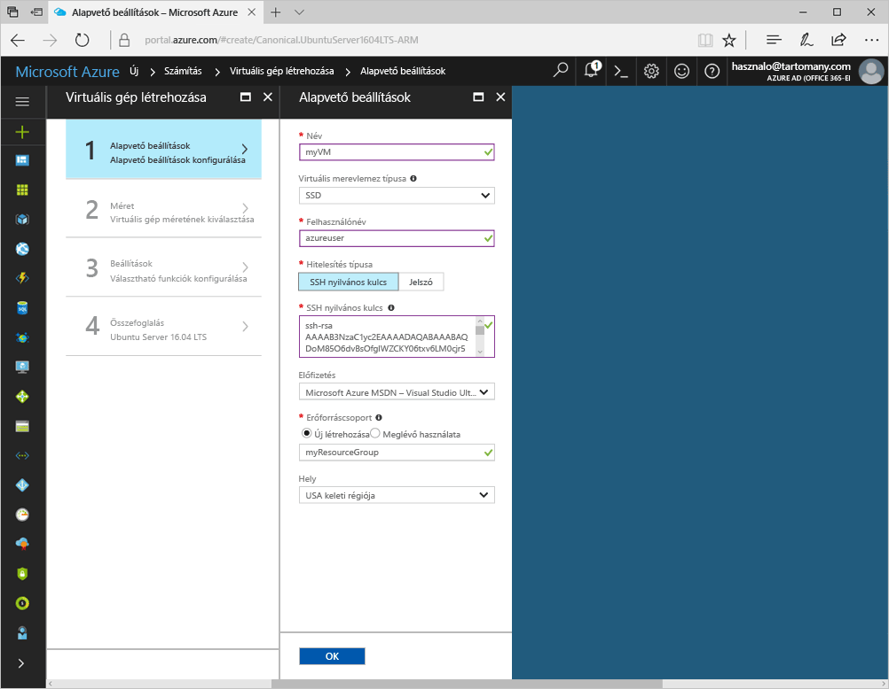
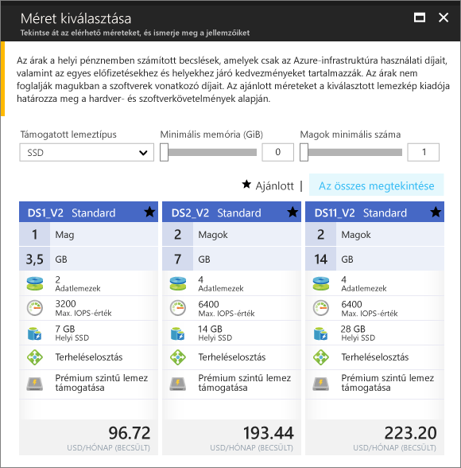
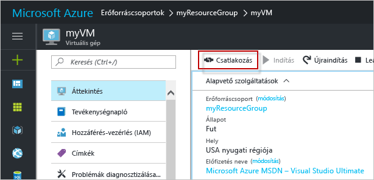

# <a name="create-a-linux-virtual-machine-with-hello-azure-portal"></a><span data-ttu-id="85c1c-103">Hozzon létre egy Linux virtuális gép hello Azure-portálon</span><span class="sxs-lookup"><span data-stu-id="85c1c-103">Create a Linux virtual machine with hello Azure portal</span></span>

<span data-ttu-id="85c1c-104">Az Azure virtuális gépek hello Azure-portálon keresztül is létrehozható.</span><span class="sxs-lookup"><span data-stu-id="85c1c-104">Azure virtual machines can be created through hello Azure portal.</span></span> <span data-ttu-id="85c1c-105">Ez a módszer egy böngészőalapú felhasználói felületet biztosít a virtuális gépek, valamint az összes kapcsolódó erőforrás létrehozásához és konfigurálásához.</span><span class="sxs-lookup"><span data-stu-id="85c1c-105">This method provides a browser-based user interface for creating and configuring virtual machines and all related resources.</span></span> <span data-ttu-id="85c1c-106">A gyors üzembe helyezés lépéseit egy virtuális gépet hoz létre, és egy webkiszolgáló hello VM telepíti.</span><span class="sxs-lookup"><span data-stu-id="85c1c-106">This Quickstart steps through creating a virtual machine and installing a webserver on hello VM.</span></span>

<span data-ttu-id="85c1c-107">Ha nem rendelkezik Azure-előfizetéssel, mindössze néhány perc alatt létrehozhat egy [ingyenes fiókot](https://azure.microsoft.com/free/?WT.mc_id=A261C142F) a virtuális gép létrehozásának megkezdése előtt.</span><span class="sxs-lookup"><span data-stu-id="85c1c-107">If you don't have an Azure subscription, create a [free account](https://azure.microsoft.com/free/?WT.mc_id=A261C142F) before you begin.</span></span>

## <a name="create-ssh-key-pair"></a><span data-ttu-id="85c1c-108">SSH-kulcspár létrehozása</span><span class="sxs-lookup"><span data-stu-id="85c1c-108">Create SSH key pair</span></span>

<span data-ttu-id="85c1c-109">A gyors üzembe helyezési szüksége van egy SSH-kulcspár toocomplete.</span><span class="sxs-lookup"><span data-stu-id="85c1c-109">You need an SSH key pair toocomplete this quick start.</span></span> <span data-ttu-id="85c1c-110">Ha már rendelkezik SSH-kulcspárral, kihagyhatja ezt a lépést.</span><span class="sxs-lookup"><span data-stu-id="85c1c-110">If you have an existing SSH key pair, this step can be skipped.</span></span>

<span data-ttu-id="85c1c-111">A rendszerhéjakba futtassa ezt a parancsot, és kövesse hello képernyőn megjelenő utasításokat.</span><span class="sxs-lookup"><span data-stu-id="85c1c-111">From a Bash shell, run this command and follow hello on-screen directions.</span></span> <span data-ttu-id="85c1c-112">hello parancs kimenete hello hello nyilvános kulcsfájl nevét tartalmazza.</span><span class="sxs-lookup"><span data-stu-id="85c1c-112">hello command output includes hello file name of hello public key file.</span></span> <span data-ttu-id="85c1c-113">Hello tartalom hello nyilvános kulcsot tartalmazó fájlt toohello vágólapra másolása.</span><span class="sxs-lookup"><span data-stu-id="85c1c-113">Copy hello contents of hello public key file toohello clipboard.</span></span>

```bash
ssh-keygen -t rsa -b 2048
```

## <a name="log-in-tooazure"></a><span data-ttu-id="85c1c-114">Jelentkezzen be tooAzure</span><span class="sxs-lookup"><span data-stu-id="85c1c-114">Log in tooAzure</span></span> 

<span data-ttu-id="85c1c-115">Jelentkezzen be toohello http://portal.azure.com: az Azure portál.</span><span class="sxs-lookup"><span data-stu-id="85c1c-115">Log in toohello Azure portal at http://portal.azure.com.</span></span>

## <a name="create-virtual-machine"></a><span data-ttu-id="85c1c-116">Virtuális gép létrehozása</span><span class="sxs-lookup"><span data-stu-id="85c1c-116">Create virtual machine</span></span>

1. <span data-ttu-id="85c1c-117">Kattintson a hello **új** hello bal felső sarkában hello Azure-portálon található gombra.</span><span class="sxs-lookup"><span data-stu-id="85c1c-117">Click hello **New** button found on hello upper left-hand corner of hello Azure portal.</span></span>

2. <span data-ttu-id="85c1c-118">Válassza a **Számítás**, majd az **Ubuntu Server 16.04 LTS** elemet.</span><span class="sxs-lookup"><span data-stu-id="85c1c-118">Select **Compute**, and then select **Ubuntu Server 16.04 LTS**.</span></span> 

3. <span data-ttu-id="85c1c-119">Adja meg a hello virtuális gép adatait.</span><span class="sxs-lookup"><span data-stu-id="85c1c-119">Enter hello virtual machine information.</span></span> <span data-ttu-id="85c1c-120">A **Hitelesítés típusa** résznél válassza az **SSH nyilvános kulcs** lehetőséget.</span><span class="sxs-lookup"><span data-stu-id="85c1c-120">For **Authentication type**, select **SSH public key**.</span></span> <span data-ttu-id="85c1c-121">A nyilvános SSH-kulcs beillesztéskor gondoskodunk tooremove bármely kezdő vagy záró szóközt.</span><span class="sxs-lookup"><span data-stu-id="85c1c-121">When pasting in your SSH public key, take care tooremove any leading or trailing white space.</span></span> <span data-ttu-id="85c1c-122">Amikor végzett, kattintson az **OK** gombra.</span><span class="sxs-lookup"><span data-stu-id="85c1c-122">When complete, click **OK**.</span></span>

    

4. <span data-ttu-id="85c1c-124">Virtuális gép hello kiválasztásához.</span><span class="sxs-lookup"><span data-stu-id="85c1c-124">Select a size for hello VM.</span></span> <span data-ttu-id="85c1c-125">toosee további méretét, válasszon **összes** , vagy módosítsa a hello **lemez típusát támogatott** szűrő.</span><span class="sxs-lookup"><span data-stu-id="85c1c-125">toosee more sizes, select **View all** or change hello **Supported disk type** filter.</span></span> 

      

5. <span data-ttu-id="85c1c-127">A hello-beállítások panelen hello alapértelmezett tartani, és kattintson a **OK**.</span><span class="sxs-lookup"><span data-stu-id="85c1c-127">On hello settings blade, keep hello defaults and click **OK**.</span></span>

6. <span data-ttu-id="85c1c-128">Hello összefoglaló lapon kattintson **Ok** toostart hello virtuálisgép-telepítést.</span><span class="sxs-lookup"><span data-stu-id="85c1c-128">On hello summary page, click **Ok** toostart hello virtual machine deployment.</span></span>

7. <span data-ttu-id="85c1c-129">virtuális gép hello Azure portál Irányítópultjára rögzített toohello lesz.</span><span class="sxs-lookup"><span data-stu-id="85c1c-129">hello VM will be pinned toohello Azure portal dashboard.</span></span> <span data-ttu-id="85c1c-130">Hello központi telepítés befejezése után automatikusan megnyílik hello VM összefoglaló panel.</span><span class="sxs-lookup"><span data-stu-id="85c1c-130">Once hello deployment has completed, hello VM summary blade automatically opens.</span></span>


## <a name="connect-toovirtual-machine"></a><span data-ttu-id="85c1c-131">Csatlakoztassa a gépet toovirtual</span><span class="sxs-lookup"><span data-stu-id="85c1c-131">Connect toovirtual machine</span></span>

<span data-ttu-id="85c1c-132">Az SSH-kapcsolat létrehozása hello virtuális géppel.</span><span class="sxs-lookup"><span data-stu-id="85c1c-132">Create an SSH connection with hello virtual machine.</span></span>

1. <span data-ttu-id="85c1c-133">Kattintson a hello **Connect** hello virtuális gépek paneljét gombjára.</span><span class="sxs-lookup"><span data-stu-id="85c1c-133">Click hello **Connect** button on hello virtual machine blade.</span></span> <span data-ttu-id="85c1c-134">hello csatlakozás gomb megjelenítése egy SSH-kapcsolati karakterlánc, amely használt tooconnect toohello virtuális géphez.</span><span class="sxs-lookup"><span data-stu-id="85c1c-134">hello connect button displays an SSH connection string that can be used tooconnect toohello virtual machine.</span></span>

     

2. <span data-ttu-id="85c1c-136">Futtatási hello következő parancsot a toocreate egy SSH-munkamenetet.</span><span class="sxs-lookup"><span data-stu-id="85c1c-136">Run hello following command toocreate an SSH session.</span></span> <span data-ttu-id="85c1c-137">Cserélje le egy másolta az Azure-portálon hello hello hello kapcsolati karakterláncot.</span><span class="sxs-lookup"><span data-stu-id="85c1c-137">Replace hello connection string with hello one you copied from hello Azure portal.</span></span>

```bash 
ssh azureuser@40.112.21.50
```

## <a name="install-nginx"></a><span data-ttu-id="85c1c-138">Az NGINX telepítése</span><span class="sxs-lookup"><span data-stu-id="85c1c-138">Install NGINX</span></span>

<span data-ttu-id="85c1c-139">Használjon hello alábbi parancsfájl tooupdate csomag források bash, és hello legújabb NGINX csomag telepítése.</span><span class="sxs-lookup"><span data-stu-id="85c1c-139">Use hello following bash script tooupdate package sources and install hello latest NGINX package.</span></span> 

```bash 
#!/bin/bash

# update package source
sudo apt-get -y update

# install NGINX
sudo apt-get -y install nginx
```

<span data-ttu-id="85c1c-140">Lépjen ki a hello SSH-munkamenetet, és adja vissza hello virtuális gép tulajdonságok hello Azure-portálon.</span><span class="sxs-lookup"><span data-stu-id="85c1c-140">When done, exit hello SSH session and return hello VM properties in hello Azure portal.</span></span>


## <a name="open-port-80-for-web-traffic"></a><span data-ttu-id="85c1c-141">A 80-as port megnyitása a webes adatforgalom számára</span><span class="sxs-lookup"><span data-stu-id="85c1c-141">Open port 80 for web traffic</span></span> 

<span data-ttu-id="85c1c-142">A hálózati biztonsági csoport (NSG) feladata a bejövő és kimenő forgalom védelme.</span><span class="sxs-lookup"><span data-stu-id="85c1c-142">A Network security group (NSG) secures inbound and outbound traffic.</span></span> <span data-ttu-id="85c1c-143">Ha egy virtuális gép létrehozása az Azure-portálon hello, egy bejövő forgalomra vonatkozó szabály az SSH-kapcsolatokhoz 22-es portot jön létre.</span><span class="sxs-lookup"><span data-stu-id="85c1c-143">When a VM is created from hello Azure portal, an inbound rule is created on port 22 for SSH connections.</span></span> <span data-ttu-id="85c1c-144">A virtuális gép egy webkiszolgáló üzemelteti, mert egy NSG-szabály a 80-as port számára létrehozott toobe kell.</span><span class="sxs-lookup"><span data-stu-id="85c1c-144">Because this VM hosts a webserver, an NSG rule needs toobe created for port 80.</span></span>

1. <span data-ttu-id="85c1c-145">Hello virtuális gépre, kattintson a hello hello neve **erőforráscsoport**.</span><span class="sxs-lookup"><span data-stu-id="85c1c-145">On hello virtual machine, click hello name of hello **Resource group**.</span></span>
2. <span data-ttu-id="85c1c-146">Jelölje be hello **hálózati biztonsági csoport**.</span><span class="sxs-lookup"><span data-stu-id="85c1c-146">Select hello **network security group**.</span></span> <span data-ttu-id="85c1c-147">hello NSG használatával azonosíthatók hello **típus** oszlop.</span><span class="sxs-lookup"><span data-stu-id="85c1c-147">hello NSG can be identified using hello **Type** column.</span></span> 
3. <span data-ttu-id="85c1c-148">Kattintson a bal oldali menüben hello, a beállítások **bejövő biztonsági szabályok**.</span><span class="sxs-lookup"><span data-stu-id="85c1c-148">On hello left-hand menu, under settings, click **Inbound security rules**.</span></span>
4. <span data-ttu-id="85c1c-149">Kattintson a **Hozzáadás** gombra.</span><span class="sxs-lookup"><span data-stu-id="85c1c-149">Click on **Add**.</span></span>
5. <span data-ttu-id="85c1c-150">A **Név** mezőbe írja be a **http** karakterláncot.</span><span class="sxs-lookup"><span data-stu-id="85c1c-150">In **Name**, type **http**.</span></span> <span data-ttu-id="85c1c-151">Győződjön meg arról, hogy **porttartomány** too80 beállítása és **művelet** értéke túl**engedélyezése**.</span><span class="sxs-lookup"><span data-stu-id="85c1c-151">Make sure **Port range** is set too80 and **Action** is set too**Allow**.</span></span> 
6. <span data-ttu-id="85c1c-152">Kattintson az **OK** gombra.</span><span class="sxs-lookup"><span data-stu-id="85c1c-152">Click **OK**.</span></span>


## <a name="view-hello-nginx-welcome-page"></a><span data-ttu-id="85c1c-153">Hello NGINX üdvözlőlap megtekintése</span><span class="sxs-lookup"><span data-stu-id="85c1c-153">View hello NGINX welcome page</span></span>

<span data-ttu-id="85c1c-154">Az NGINX telepített, és a port 80 nyissa meg a tooyour VM, hello webkiszolgáló most elérhető hello az interneten.</span><span class="sxs-lookup"><span data-stu-id="85c1c-154">With NGINX installed, and port 80 open tooyour VM, hello webserver can now be accessed from hello internet.</span></span> <span data-ttu-id="85c1c-155">Nyisson meg egy webböngészőt, és adja meg a virtuális gép hello hello nyilvános IP-címét.</span><span class="sxs-lookup"><span data-stu-id="85c1c-155">Open a web browser, and enter hello public IP address of hello VM.</span></span> <span data-ttu-id="85c1c-156">hello VM panel az Azure-portálon hello hello nyilvános IP-cím található.</span><span class="sxs-lookup"><span data-stu-id="85c1c-156">hello public IP address can be found on hello VM blade in hello Azure portal.</span></span>

 

## <a name="clean-up-resources"></a><span data-ttu-id="85c1c-158">Az erőforrások eltávolítása</span><span class="sxs-lookup"><span data-stu-id="85c1c-158">Clean up resources</span></span>

<span data-ttu-id="85c1c-159">Ha már nincs szükség, törölje a hello erőforráscsoport, a virtuális gép és az összes kapcsolódó erőforrások.</span><span class="sxs-lookup"><span data-stu-id="85c1c-159">When no longer needed, delete hello resource group, virtual machine, and all related resources.</span></span> <span data-ttu-id="85c1c-160">toodo Igen, jelölje ki hello erőforráscsoport hello virtuális gépek paneljét, majd kattintson **törlése**.</span><span class="sxs-lookup"><span data-stu-id="85c1c-160">toodo so, select hello resource group from hello virtual machine blade and click **Delete**.</span></span>

## <a name="next-steps"></a><span data-ttu-id="85c1c-161">Következő lépések</span><span class="sxs-lookup"><span data-stu-id="85c1c-161">Next steps</span></span>

<span data-ttu-id="85c1c-162">Ebben a rövid útmutatóban üzembe helyezett egy egyszerű virtuális gépet, egy hálózati biztonsági csoport szabályát, valamint telepített egy webkiszolgálót.</span><span class="sxs-lookup"><span data-stu-id="85c1c-162">In this quick start, you’ve deployed a simple virtual machine, a network security group rule, and installed a web server.</span></span> <span data-ttu-id="85c1c-163">További információ az Azure virtuális gépeken, toolearn toohello oktatóanyag Linux virtuális gépek továbbra is.</span><span class="sxs-lookup"><span data-stu-id="85c1c-163">toolearn more about Azure virtual machines, continue toohello tutorial for Linux VMs.</span></span>

> [!div class="nextstepaction"]
> [<span data-ttu-id="85c1c-164">Azure-beli Linux rendszerű virtuális gépek – oktatóanyag</span><span class="sxs-lookup"><span data-stu-id="85c1c-164">Azure Linux virtual machine tutorials</span></span>](./tutorial-manage-vm.md)
