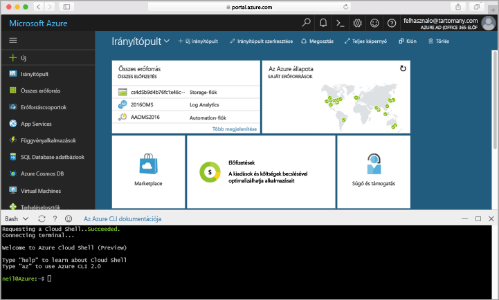

## Az Azure Cloud Shell indításaLaunch Azure Cloud Shell

Az Azure Cloud Shell olyan ingyenes Bash-felület, amelyet közvetlenül futtathat az Azure Portalon.The Azure Cloud Shell is a free Bash shell that you can run directly within the Azure portal. A fiókjával való használat érdekében az Azure CLI már előre telepítve és konfigurálva van rajta.It has the Azure CLI preinstalled and configured to use with your account. Az [Azure Portal](https://portal.azure.com) jobb felső sarkában található menüben kattintson a **Cloud Shell** gombra.Click the **Cloud Shell** button on the menu in the upper-right of the [Azure portal](https://portal.azure.com).

A gombra kattintva interaktív kezelőfelület jelenik meg, amelyet az ebben a témakörben található valamennyi lépés futtatására használhat:The button launches an interactive shell that you can use to run all of the steps in this topic:

