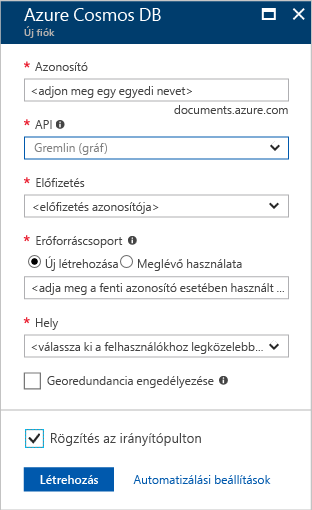

1. Egy új ablakban jelentkezzen be az [Azure Portalra](https://portal.azure.com/).In a new window, sign in to the [Azure portal](https://portal.azure.com/).
2. A bal oldali panelen kattintson az **Új**, az **Adatbázisok**, majd az **Azure Cosmos DB** elemre, végül a **Létrehozás** parancsra.In the left pane, click **New**, click **Databases**, and then under **Azure Cosmos DB**, click **Create**.
   
   

3. Az **Új fiók** panelen adja meg az Azure Cosmos DB-fiók kívánt beállításait.In the **New account** blade, specify the configuration that you want for this Azure Cosmos DB account. 

    Az Azure Cosmos DB használata esetén négy programozási modell közül választhat: Gremlin (Graph), MongoDB, SQL (DocumentDB) vagy Tábla (kulcs-érték). Jelenleg mindegyikhez külön fiókra van szükség.With Azure Cosmos DB, you can choose one of four programming models: Gremlin (graph), MongoDB, SQL (DocumentDB), and Table (key-value), each which currently require a separate account.
       
    Ebben a rövid útmutatóban a Graph API használatával fogunk programozni, tehát a **Gremlin (gráf)** lehetőséget fogja választani az űrlap kitöltésekor.In this quick-start article, we program against the Graph API, so choose **Gremlin (graph)** as you fill out the form. Ha katalógusalkalmazásból származó dokumentumadatokkal, kulcs/érték (tábla) típusú adatokkal vagy MongoDB-alkalmazásból migrált adatokkal dolgozik, vegye figyelembe, hogy az Azure Cosmos DB magas rendelkezésre állású, globálisan elosztott adatbázis-szolgáltatási platformot tud biztosítani az összes alapvető fontosságú alkalmazáshoz.If you have document data from a catalog app, key/value (table) data, or data that's migrated from a MongoDB app, realize that Azure Cosmos DB can provide a highly available, globally distributed database service platform for all your mission-critical applications.

    Töltse ki az **Új fiók** panel mezőit. Ehhez használja segítségként az alábbi képernyőképen szereplő információkat – az Ön értékei eltérhetnek a képernyőképen láthatóktól.Complete the fields on the **New account** blade, using the information in the following screenshot as a guide - your values may be different than the values in the screenshot.
 
    

    BeállításSetting|Ajánlott értékSuggested value|LeírásDescription
    ---|---|---
    ID (Azonosító)ID|*Egyedi érték**Unique value*|Az Azure Cosmos DB-fiókot azonosító egyedi név.A unique name that identifies this Azure Cosmos DB account. A rendszer a *documents.azure.com* utótaggal egészíti ki a megadott azonosítót az URI létrehozásához, ezért válasszon egyedi, de felismerhető azonosítót.Because *documents.azure.com* is appended to the ID that you provide to create your URI, use a unique but identifiable ID. Az azonosító csak kisbetűkből, számokból és a kötőjel (-) karakterből állhat, valamint legalább 3, és legfeljebb 50 karakter hosszú lehet.The ID must contain only lowercase letters, numbers, and the hyphen (-) character, and it must contain from 3 to 50 characters.
    APIAPI|Gremlin (gráf)Gremlin (graph)|Ebben a cikkben a [Graph API](../articles/cosmos-db/graph-introduction.md) használatával programozunk.We program against the [Graph API](../articles/cosmos-db/graph-introduction.md) later in this article.|
    ElőfizetésSubscription|*Az Ön előfizetése**Your subscription*|Az Azure Cosmos DB-fiókhoz használni kívánt Azure-előfizetés.The Azure subscription that you want to use for this Azure Cosmos DB account. 
    ErőforráscsoportResource Group|*Megegyezik az azonosítóval**The same value as ID*|A fiók új erőforráscsoport-neve.The new resource group name for your account. Az egyszerűség kedvéért használhat az azonosítójával megegyező nevet.For simplicity, you can use the same name as your ID. 
    HelyLocation|*A felhasználókhoz legközelebb eső régió**The region closest to your users*|Az a földrajzi hely, ahol az Azure Cosmos DB-fiókot üzemeltetni fogja.The geographic location in which to host your Azure Cosmos DB account. Válassza ki a felhasználókhoz legközelebb lévő helyet, hogy a lehető leggyorsabb hozzáférést biztosítsa az adatokhoz.Choose the location closest to your users to give them the fastest access to the data.

4. A fiók létrehozásához kattintson a **Létrehozás** gombra.Click **Create** to create the account.
5. A felső eszköztáron kattintson az **Értesítések** ikonra  az üzembe helyezési folyamat monitorozásához.On the top toolbar, click the **Notifications** icon  to monitor the deployment process.

    

6.  Amikor az Értesítések ablak azt jelzi, hogy az üzembe helyezés sikeresen megtörtént, zárja be az értesítési ablakot, és nyissa meg az új fiókot az Irányítópult **Minden erőforrás** csempéjéről.When the Notifications window indicates the deployment succeeded, close the notification window and open the new account from the **All Resources** tile on the Dashboard. 

    