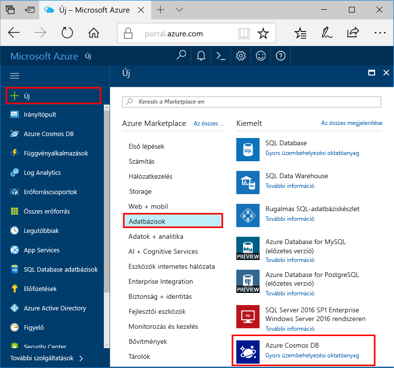

1. Egy új ablakban toohello bejelentkezés [Azure-portálon](https://portal.azure.com/).In a new window, sign in toohello [Azure portal](https://portal.azure.com/).
2. Hello bal oldali ablaktáblában kattintson **új**, kattintson a **adatbázisok**, majd a **Azure Cosmos DB**, kattintson a **létrehozása**.In hello left pane, click **New**, click **Databases**, and then under **Azure Cosmos DB**, click **Create**.
   
   

3. A hello **új fiók** panelen adja meg az Azure Cosmos DB fiókhoz használni kívánt hello konfigurációt.In hello **New account** blade, specify hello configuration that you want for this Azure Cosmos DB account. 

    Az Azure Cosmos DB használata esetén négy programozási modell közül választhat: Gremlin (Graph), MongoDB, SQL (DocumentDB) vagy Tábla (kulcs-érték). Jelenleg mindegyikhez külön fiókra van szükség.With Azure Cosmos DB, you can choose one of four programming models: Gremlin (graph), MongoDB, SQL (DocumentDB), and Table (key-value), each which currently require a separate account.
       
    A gyors üzembe helyezési cikkben azt program elleni hello Graph API-val, tehát **Gremlin (diagramhoz)** , hello űrlap kitöltötte.In this quick-start article, we program against hello Graph API, so choose **Gremlin (graph)** as you fill out hello form. Ha katalógusalkalmazásból származó dokumentumadatokkal, kulcs/érték (tábla) típusú adatokkal vagy MongoDB-alkalmazásból migrált adatokkal dolgozik, vegye figyelembe, hogy az Azure Cosmos DB magas rendelkezésre állású, globálisan elosztott adatbázis-szolgáltatási platformot tud biztosítani az összes alapvető fontosságú alkalmazáshoz.If you have document data from a catalog app, key/value (table) data, or data that's migrated from a MongoDB app, realize that Azure Cosmos DB can provide a highly available, globally distributed database service platform for all your mission-critical applications.

    Töltse ki a hello hello mezőket **új fiók** panelen használatával hello információi hello következő útmutatóként – képernyőfelvétel az értékek eltérhetnek hello képernyőfelvétel a hello értékeket.Complete hello fields on hello **New account** blade, using hello information in hello following screenshot as a guide - your values may be different than hello values in hello screenshot.
 
    

    BeállításSetting|Ajánlott értékSuggested value|LeírásDescription
    ---|---|---
    ID (Azonosító)ID|*Egyedi érték**Unique value*|Az Azure Cosmos DB-fiókot azonosító egyedi név.A unique name that identifies this Azure Cosmos DB account. Mivel *documents.azure.com* van hozzáfűzött toohello adni toocreate az URI, használja a egyedi, de azonosítható ID azonosítójával.Because *documents.azure.com* is appended toohello ID that you provide toocreate your URI, use a unique but identifiable ID. hello azonosítója csak kisbetűket, számokat és kötőjel (-) karakter hello tartalmaznia kell, és a 3 too50 karaktereket kell tartalmaznia.hello ID must contain only lowercase letters, numbers, and hello hyphen (-) character, and it must contain from 3 too50 characters.
    APIAPI|Gremlin (gráf)Gremlin (graph)|Azt a program hello elleni [Graph API](../articles/cosmos-db/graph-introduction.md) című cikkben.We program against hello [Graph API](../articles/cosmos-db/graph-introduction.md) later in this article.|
    ElőfizetésSubscription|*Az Ön előfizetése**Your subscription*|hello Azure-előfizetést, amelyet az toouse Azure Cosmos DB ehhez a fiókhoz.hello Azure subscription that you want toouse for this Azure Cosmos DB account. 
    ErőforráscsoportResource Group|*hello azonos érték-azonosító**hello same value as ID*|hello új erőforráscsoport neve a fiókjához.hello new resource group name for your account. Az egyszerűség kedvéért is használhatja ugyanazt a nevet hello a azonosítójával.For simplicity, you can use hello same name as your ID. 
    HelyLocation|*hello régió legközelebbi tooyour felhasználók**hello region closest tooyour users*|földrajzi helyet, mely toohost hello Azure Cosmos DB fiókját.hello geographic location in which toohost your Azure Cosmos DB account. Válassza ki a hello helyét legközelebbi tooyour felhasználók toogive leggyorsabb hozzáférést toohello adatok hello őket.Choose hello location closest tooyour users toogive them hello fastest access toohello data.

4. Kattintson a **létrehozása** toocreate hello fiók.Click **Create** toocreate hello account.
5. A hello felső eszköztáron kattintson a hello **értesítések** ikon  toomonitor hello telepítési folyamat.On hello top toolbar, click hello **Notifications** icon  toomonitor hello deployment process.

    

6.  Ha hello értesítések ablakban azt jelzi, hello központi telepítés sikeresen befejeződött, zárja be hello értesítési ablakban, és új fiókot nyitott hello hello **összes erőforrás** hello irányítópult csempét.When hello Notifications window indicates hello deployment succeeded, close hello notification window and open hello new account from hello **All Resources** tile on hello Dashboard. 

    
