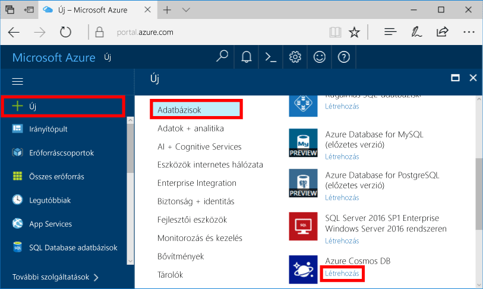
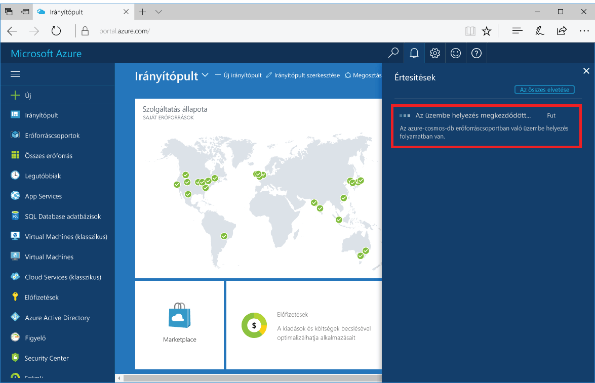
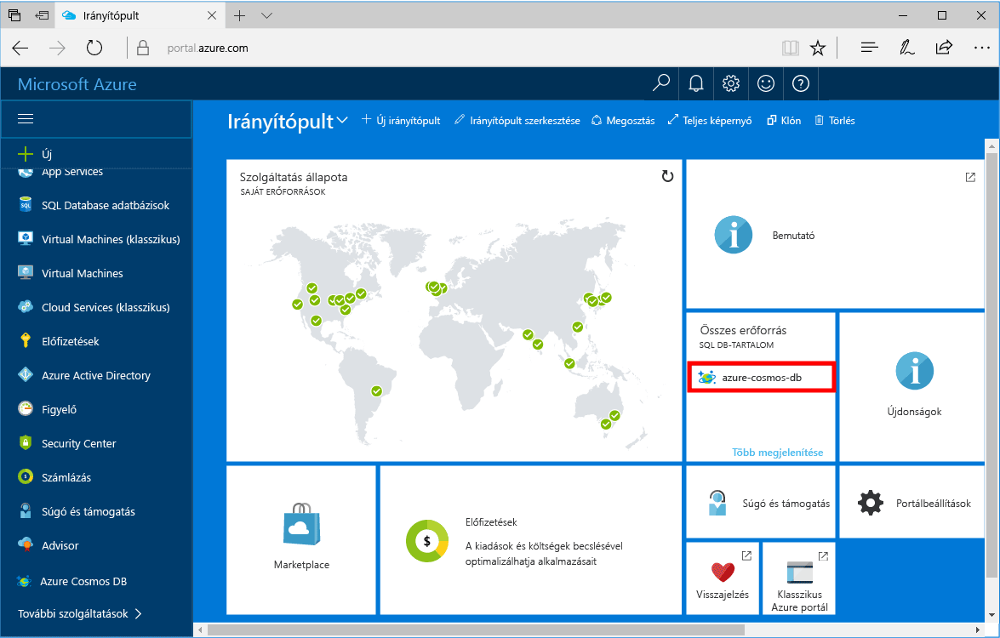

1. Egy új ablakban toohello bejelentkezés [Azure-portálon](https://portal.azure.com/).
2. Hello bal oldali menüben kattintson a **új**, kattintson a **adatbázisok**, majd a **Azure Cosmos DB**, kattintson a **létrehozása**.
   
   

3. A hello **új fiók** panelen adja meg a hello hello Azure Cosmos DB fiók kívánt beállításait. 

    Az Azure Cosmos DB használata esetén négy programozási modell közül választhat: Gremlin (gráf), MongoDB, SQL (DocumentDB) és a tábla (kulcs-érték). 
       
    A gyors üzembe helyezési a azt fogja kell programozási hello MongoDB API ellen, akkor érdemes választani **MongoDB** , hello űrlap kitöltötte. Ha azonban közösségi média gráfadataival, a katalógusalkalmazásból származó dokumentumadatokkal vagy kulcs/érték (tábla) típusú adatokkal dolgozik, vegye figyelembe, hogy az Azure Cosmos DB magas rendelkezésre állású, globálisan elosztott adatbázis-szolgáltatási platformot tud biztosítani az összes alapvető fontosságú alkalmazáshoz.

    Töltse ki a hello **új fiók** hello információk alapján hello tábla útmutatóként panelen.
 
    
   
    Beállítás|Ajánlott érték|Leírás
    ---|---|---
    ID (Azonosító)|*Egyedi érték*|Egy egyedi nevet az tooidentify hello Azure Cosmos DB fiók választja. *Documents.Azure.com* hozzáfűzött toohello-azonosító akkor adja meg a toocreate az URI, ezért egy egyedi, de azonosítható. hello azonosító is tartalmazhat, csak kisbetűket, számokat és hello "-" karakter, és 3 – 50 karakter közé kell esnie.
    API|MongoDB|Azt fogja programozási, hello elleni [MongoDB API](../articles/documentdb/documentdb-protocol-mongodb.md) című cikkben.|
    Előfizetés|*Az Ön előfizetése*|hello Azure-előfizetést, amelyet az toouse hello Azure Cosmos DB fiók. 
    Erőforráscsoport|*hello azonos érték-azonosító*|hello új erőforráscsoport neve a fiókjához. Az egyszerűség kedvéért is használhatja ugyanazt a nevet hello a azonosítójával. 
    Hely|*hello régió legközelebbi tooyour felhasználók*|földrajzi helyet, mely toohost hello Azure Cosmos DB fiókját. Válassza ki a hello helyét legközelebbi tooyour felhasználók toogive leggyorsabb hozzáférést toohello adatok hello őket.

4. Kattintson a **létrehozása** toocreate hello fiók.
5. Hello eszköztáron kattintson **értesítések** toomonitor hello telepítési folyamat.

    

6.  Hello telepítés befejeződése után nyissa meg hello hello új fiókot összes erőforrás csempére. 

    
