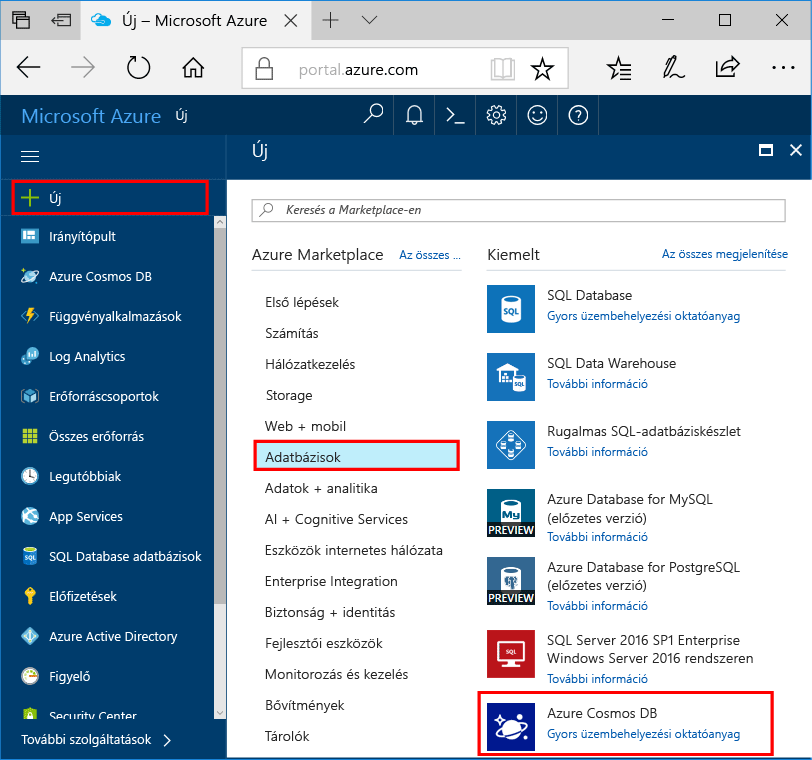

1. Egy új ablakban toohello bejelentkezés [Azure-portálon](https://portal.azure.com/).
2. Hello bal oldali ablaktáblában kattintson **új**, kattintson a **adatbázisok**, majd a **Azure Cosmos DB**, kattintson a **létrehozása**.
   
   

3. A hello **új fiók** panelen adja meg az Azure Cosmos DB fiókhoz használni kívánt hello konfigurációt. 

    Az Azure Cosmos DB használata esetén négy programozási modell közül választhat: Gremlin (Graph), MongoDB, SQL (DocumentDB) vagy Tábla (kulcs-érték). Jelenleg mindegyikhez külön fiókra van szükség.
    
    A gyors üzembe helyezési cikkben azt program hello DocumentDB API szemben, ezért válasszon **SQL (DocumentDB)** , hello űrlap kitöltötte. Ha egy közösségi hálózati alkalmazás gráfadataival, kulcs/érték (tábla) típusú adatokkal vagy MongoDB-alkalmazásból migrált adatokkal dolgozik, vegye figyelembe, hogy az Azure Cosmos DB képes magas rendelkezésre állású, globálisan elosztott adatbázis-szolgáltatási platformot biztosítani az összes alapvető fontosságú alkalmazáshoz.

    Töltse ki a hello hello mezőket **új fiók** panelen hello információk a következő képernyőkép az útmutató-hello segítségével az értékek eltérhetnek hello képernyőfelvétel a hello értékeket.
 
    

    Beállítás|Ajánlott érték|Leírás
    ---|---|---
    ID (Azonosító)|*Egyedi érték*|Az Azure Cosmos DB-fiókot azonosító egyedi név. Mivel *documents.azure.com* van hozzáfűzött toohello adni toocreate az URI, használja a egyedi, de azonosítható ID azonosítójával. hello azonosítója csak kisbetűket, számokat és kötőjel (-) karakter hello tartalmazhat, és 3 too50 karaktert kell tartalmaznia.
    API|SQL (DocumentDB)|Azt a program hello elleni [DocumentDB API](../articles/documentdb/documentdb-introduction.md) című cikkben.|
    Előfizetés|*Az Ön előfizetése*|hello Azure-előfizetést, amelyet az toouse Azure Cosmos DB ehhez a fiókhoz. 
    Erőforráscsoport|*hello azonos érték-azonosító*|hello új erőforráscsoport nevet a fiókjához. Az egyszerűség kedvéért is használhatja ugyanazt a nevet hello a azonosítójával. 
    Hely|*hello régió legközelebbi tooyour felhasználók*|földrajzi helyet, mely toohost hello Azure Cosmos DB fiókját. Válassza ki azokat a leggyorsabb hozzáférést toohello adatok hello legközelebbi tooyour felhasználók toogive hello helyet.
4. Kattintson a **létrehozása** toocreate hello fiók.
5. A hello felső eszköztáron kattintson a hello **értesítések** ikon  toomonitor hello telepítési folyamat.

    

6.  Ha hello értesítések ablakban azt jelzi, hello központi telepítés sikeresen befejeződött, zárja be hello értesítési ablakban, és új fiókot nyitott hello hello **összes erőforrás** hello irányítópult csempét. 

    
 
