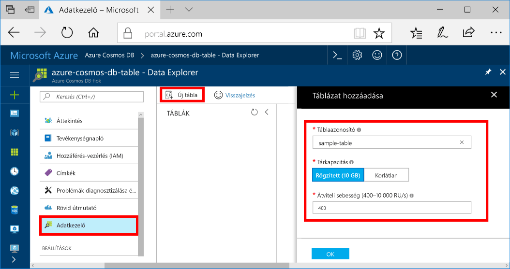

Most már használhatja az adatkezelő toocreate egy tábla és adatok tooyour adatbázis hozzáadása.You can now use Data Explorer toocreate a table and add data tooyour database. 

1. A navigációs menü hello Azure-portálon hello kattintson **adatok kezelővel (előzetes verzió)**.In hello Azure portal, in hello navigation menu, click **Data Explorer (Preview)**. 
2. Hello adatkezelő paneljén kattintson **új tábla**, majd adja meg a hello lapot hello a következő információ használatával.In hello Data Explorer blade, click **New Table**, then fill in hello page using hello following information.

    

    BeállításSetting|Ajánlott értékSuggested value|LeírásDescription
    ---|---|---
    TáblaazonosítóTable Id|minta táblasample-table|az új tábla hello azonosítója.hello ID for your new table. Táblanevek rendelkezik hello azonos követelmények karakter, adatbázis-azonosító.Table names have hello same character requirements as database ids. Az adatbázis neve 1–255 karakter hosszúságú lehet, és nem tartalmazhat `/ \ # ?` karaktereket vagy záró szóközt.Database names must be between 1 and 255 characters, and cannot contain `/ \ # ?` or a trailing space.
    TárkapacitásStorage capacity| 10 GB10 GB|Hagyja hello alapértelmezett értéket.Leave hello default value. Ez a hello tárolási kapacitás hello adatbázis.This is hello storage capacity of hello database.
    TeljesítményThroughput|400 kérelemegység400 RUs|Hagyja hello alapértelmezett értéket.Leave hello default value. Hello költenie [átviteli](../articles/cosmos-db/request-units.md) később, ha azt szeretné, hogy tooreduce késés.You can scale up hello [throughput](../articles/cosmos-db/request-units.md) later if you want tooreduce latency.

3. Amikor hello űrlap ki van töltve, kattintson a **OK**.Once hello form is filled out, click **OK**.
