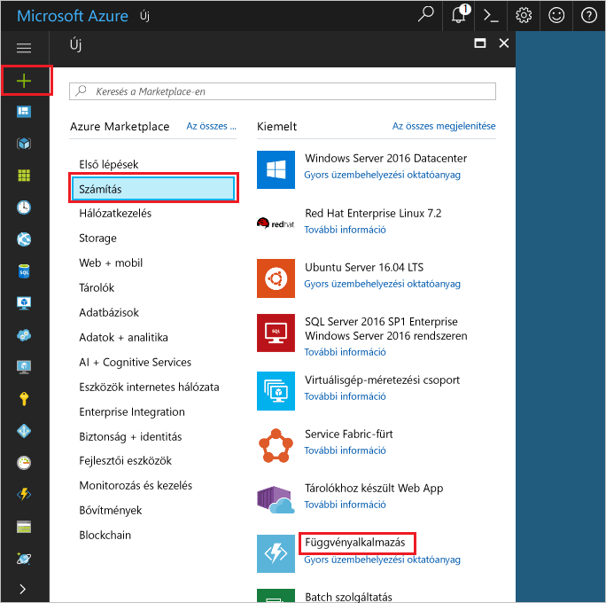

1. Kattintson a hello **új** hello bal felső sarkában hello Azure-portálon található gombra.Click hello **New** button found on hello upper left-hand corner of hello Azure portal.

1. Kattintson a **Számítás** > **Függvényalkalmazás** elemre, és válassza az **Előfizetés** elemet.Click **Compute** > **Function App**, select your **Subscription**. Ezt követően beállításokkal hello függvény app hello táblázatban megadottak szerint.Then, use hello function app settings as specified in hello table.

    

    | BeállításSetting      | Ajánlott értékSuggested value  | LeírásDescription                                        |
    | ------------ |  ------- | -------------------------------------------------- |
    | **Alkalmazás neve****App name** | Globálisan egyedi névGlobally unique name | Az új függvényalkalmazást azonosító név.Name that identifies your new function app. | 
    | **[Erőforráscsoport](../articles/azure-resource-manager/resource-group-overview.md)****[Resource Group](../articles/azure-resource-manager/resource-group-overview.md)** |  myResourceGroupmyResourceGroup | A függvény app hello mely toocreate az új erőforráscsoporthoz tartozó nevet.Name for hello new resource group in which toocreate your function app. | 
    | **[Szolgáltatási csomag](../articles/azure-functions/functions-scale.md)****[Hosting plan](../articles/azure-functions/functions-scale.md)** |   Használatalapú csomagConsumption plan | Üzemeltetési terv, amely meghatározza a-erőforrások elosztását vezérli tooyour függvény alkalmazást.Hosting plan that defines how resources are allocated tooyour function app. Hello alapértelmezett **fogyasztás megtervezése**, erőforrások hozzáadása a funkciók által megkövetelt dinamikusan.In hello default **Consumption Plan**, resources are added dynamically as required by your functions. Csak kell fizetnie hello futtatásakor a függvényeket.You only pay for hello time your functions run.   |
    | **Hely****Location** | Nyugat-EurópaWest Europe | Válasszon egy helyet a közelben vagy a függvények által elérendő más szolgáltatások közelében.Choose a location near you or near other services your functions will access. |
    | **[Tárfiók](../articles/storage/common/storage-create-storage-account.md#create-a-storage-account)****[Storage account](../articles/storage/common/storage-create-storage-account.md#create-a-storage-account)** |  Globálisan egyedi névGlobally unique name |  Hello új tárfiók a függvény alkalmazás által használt nevét.Name of hello new storage account used by your function app. A tárfiókok neve 3–24 karakter hosszúságú lehet, és csak számokból és kisbetűkből állhat.Storage account names must be between 3 and 24 characters in length and may contain numbers and lowercase letters only. Meglévő fiókot is használhat.You can also use an existing account. |

1. Kattintson a **létrehozása** tooprovision és hello új függvény alkalmazás telepítése.Click **Create** tooprovision and deploy hello new function app.
