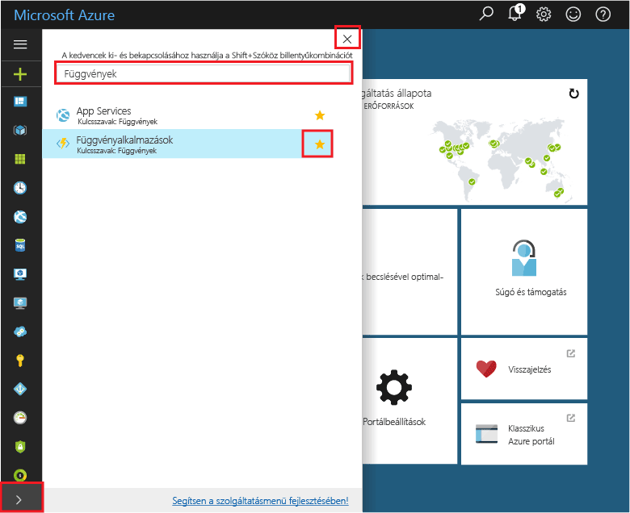
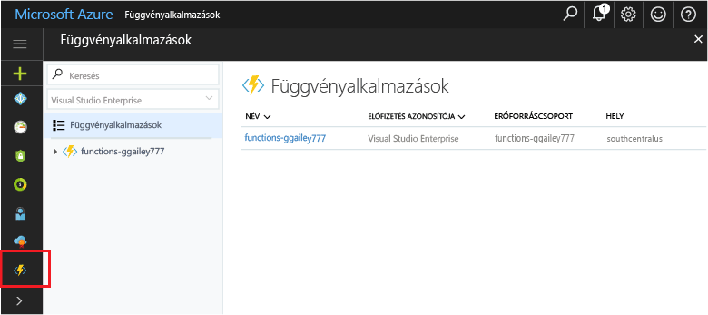

## Függvény alkalmazások tooyour portál Kedvencek hozzáadásaAdd Function Apps tooyour portal favorites 

Ha még nem tette meg, adja hozzá függvény alkalmazások tooyour Kedvencek hello Azure-portálon.If you haven't already done so, add Function Apps tooyour favorites in hello Azure portal. Így könnyebben toofind függvény alkalmazásait.This makes it easier toofind your function apps. Ha már ezt, hagyja ki a toohello a következő szakaszban.If you have already done this, skip toohello next section. 

1. Jelentkezzen be toohello [Azure-portálon](https://portal.azure.com/).Log in toohello [Azure portal](https://portal.azure.com/).

2. Kattintson a hello alsó, bal oldali tooexpand hello nyílra a szolgáltatásokat, típus `Functions` hello a **szűrő** mezőben, majd kattintson a hello csillag mellett túl**függvény alkalmazások**.Click hello arrow at hello bottom left tooexpand all services, type `Functions` in hello **Filter** field, and then click hello star next too**Function Apps**.  
 
    

    Ez a gyorsjavítás hello funkciók toohello menüje hello portál hello bal oldalon.This adds hello Functions icon toohello menu on hello left of hello portal.

3. Zárja be a hello menüben, majd görgessen lefelé toohello alsó toosee hello funkciók ikonra.Close hello menu, then scroll down toohello bottom toosee hello Functions icon. Kattintson az ikonra toosee függvény alkalmazások listáját.Click this icon toosee a list of all your function apps. Kattintson a függvény app toowork funkcióinak ezt az alkalmazást.Click your function app toowork with functions in this app. 
 
    
 
     