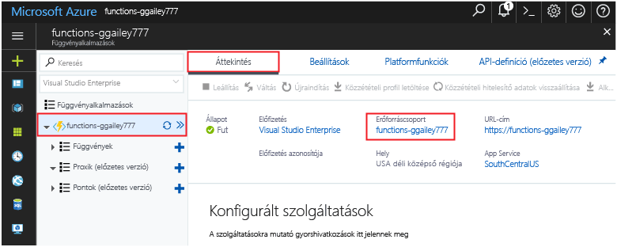

Az ebben a gyűjteményben lévő többi rövid útmutató erre a rövid útmutatóra épít. Toocontinue toowork későbbi gyors üzembe helyezések vagy hello oktatóanyagok tervezi, ha a gyors létrehozott hello erőforrások karbantartása indításának mellőzése. 

Ha nem tervezi toocontinue, kattintson a hello **erőforráscsoport** hello függvény alkalmazás hello portálon, és kattintson a **törlése**. 

