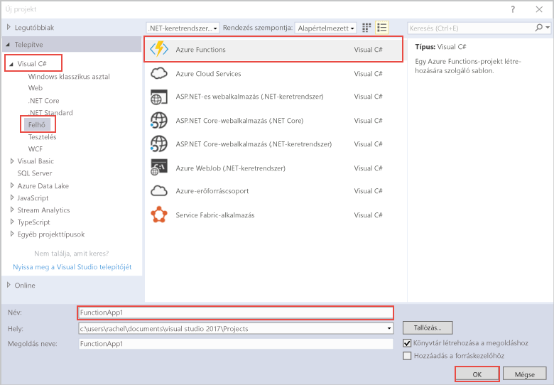

hello Azure Functions projektsablon a Visual Studio létrehoz egy projekt, amely közzétett tooa függvény alkalmazás az Azure-ban. A függvényalkalmazás lehetővé teszi, hogy logikai egységbe csoportosítsa a függvényeket az erőforrások egyszerűbb felügyelete, telepítése és megosztása érdekében.   

1. Jobb kattintásra hello projekt csomópontjára **Solution Explorer**, majd válassza a **hozzáadása** > **új elem**. Válasszon **Azure-függvény** hello párbeszédpanelről.

2. A hello **új projekt** párbeszédpanelen bontsa ki a **Visual C#** > **felhő** csomópontban jelölje ki **Azure Functions**, írja be a **Neve** a projektet, majd kattintson a **OK**. hello függvény alkalmazásnév érvényes egy C# névteret, ezért ne használjon, aláhúzásjeleket, kötőjeleket vagy bármilyen más nem alfanumerikus karaktert kell lennie. 

    
