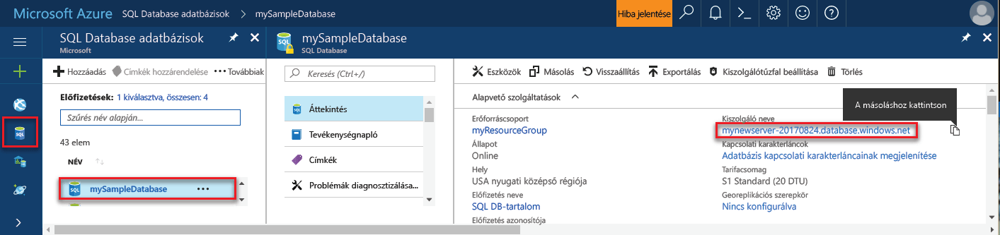

## Jelentkezzen be toohello Azure-portálon

Jelentkezzen be toohello [Azure-portálon](https://portal.azure.com/).

## Hozzon létre egy üres SQL-adatbázist hello Azure-portálon

Az Azure SQL-adatbázis [számítási és tárolási erőforrások](../articles/sql-database/sql-database-service-tiers.md) egy meghatározott készletével együtt jön létre. hello adatbázist a rendszer létrehoz egy [Azure erőforráscsoport](../articles/azure-resource-manager/resource-group-overview.md) és az egy [Azure SQL Database logikai kiszolgáló](../articles/sql-database/sql-database-features.md). 

Kövesse ezeket a lépéseket toocreate üres SQL-adatbázis. 

1. Kattintson a hello **új** hello bal felső sarkában hello Azure-portálon található gombra.

2. Válassza ki **adatbázisok** a hello **új** lapon, és válassza ki **SQL-adatbázis** a hello **adatbázisok** lap. 

   

3. Hello SQL-adatbázis űrlap kitöltése a következő információ, hello kép megelőző hello szerint:   

   | Beállítás | Ajánlott érték | Leírás |
   | --------| --------------- | ----------- | 
   | **Adatbázis neve** | mySampleDatabase | Az érvényes adatbázisnevekkel kapcsolatban lásd az [adatbázis-azonosítókat](https://docs.microsoft.com/sql/relational-databases/databases/database-identifiers) ismertető cikket. | 
   | **Előfizetés** | Az Ön előfizetése  | Az előfizetései részleteivel kapcsolatban lásd az [előfizetéseket](https://account.windowsazure.com/Subscriptions) ismertető cikket. |
   | **Erőforráscsoport** | myResourceGroup | Az érvényes erőforráscsoport-nevekkel kapcsolatban lásd az [elnevezési szabályokat és korlátozásokat](https://docs.microsoft.com/azure/architecture/best-practices/naming-conventions) ismertető cikket. |
   | **Forrás kiválasztása** | Az üres adatbázis | Meghatározza, hogy egy üres adatbázist kell létrehozni. |
   ||||

4. Kattintson a **Server** toocreate és az új adatbázis új kiszolgáló konfigurálása. Töltse ki a hello **új kiszolgáló űrlap** a következő információ hello: 

   | Beállítás | Ajánlott érték | Leírás |
   | --------| --------------- | ----------- | 
   | **Kiszolgálónév** | A globálisan egyedi nevet. | Az érvényes kiszolgálónevekkel kapcsolatban lásd az [elnevezési szabályokat és korlátozásokat](https://docs.microsoft.com/azure/architecture/best-practices/naming-conventions) ismertető cikket. | 
   | **Kiszolgálói rendszergazdai bejelentkezés** | Bármilyen érvényes nevet. | Az érvényes bejelentkezési nevekkel kapcsolatban lásd az [adatbázis-azonosítókat](https://docs.microsoft.com/sql/relational-databases/databases/database-identifiers) ismertető cikket.|
   | **Jelszó** | Bármilyen érvényes jelszót. | A jelszó legalább 8 karakterből kell állnia, és tartalmaznia kell legalább hármat a következő kategóriák hello: nagybetűk, kisbetűk, számok és nem alfanumerikus karakterek száma. |
   | **Hely** | Egyik érvényes helyen sem. | A régiókkal kapcsolatos információkért lásd [az Azure régióit](https://azure.microsoft.com/regions/) ismertető cikket. |
   ||||

   

5. Kattintson a **Kiválasztás** gombra.

6. Kattintson a **tarifacsomag** toospecify hello és teljesítményszintet szolgáltatásszint az új adatbázishoz. A jelen oktatóanyag esetében válassza ki a **20 Dtu** és **250** GB tárhelyet.

   

7. Kattintson az **Alkalmaz** gombra.  

8. Válassza ki a **rendezés** hello üres adatbázis (a jelen oktatóanyag esetében használja hello alapértelmezett érték). Rendezések kapcsolatos további információkért lásd: [rendezések](https://docs.microsoft.com/sql/t-sql/statements/collations)

9. Kattintson a **létrehozása** tooprovision hello adatbázis. Kiépítés kapcsolatos egy perc és fél toocomplete vesz igénybe. 

10. Hello eszköztáron kattintson **értesítések** toomonitor hello telepítési folyamat.

   

## Hozzon létre egy kiszolgálószintű tűzfalszabályt hello Azure-portál használatával

SQL Database szolgáltatás hello tűzfal hello kiszolgálószintű hoz létre. Kezdetben hello tűzfal megakadályozza, hogy a külső eszközök és alkalmazások toohello server vagy tooany adatbázisok hello kiszolgálón csatlakozzon. Kapcsolatainak engedélyezését követően egy tűzfalszabály tooopen bizonyos IP-címeket. Kövesse az alábbi lépéseket toocreate egy [SQL-adatbázis kiszolgálószintű tűzfalszabály](../articles/sql-database/sql-database-firewall-configure.md) a ügyfél IP-címet, és tooenable külső kapcsolatot csak az IP-cím hello SQL-adatbázis tűzfalon keresztül. 

> [!NOTE]
> Az Azure SQL Database 1433-as porton keresztül kommunikál. Adatbázis tooSQL csak azt követően a hálózat hello tűzfal lehetővé teszi, hogy a kimenő adatforgalmat a 1433-as porton keresztül is elérheti.

1. Hello központi telepítés befejezése után kattintson **SQL-adatbázisok** hello bal oldali menüből, és kattintson a **mySampleDatabase** a hello **SQL-adatbázisok** lap. hello áttekintő lapjára jut a adatbázis megnyílik, teljes mértékben hello megjelenítő minősített kiszolgáló neve (például **mynewserver20170313.database.windows.net**) és további konfigurációs lehetőségeket. Későbbi felhasználás céljára másolja ki ezt a teljes kiszolgálónevet.

   > [!IMPORTANT]
   > A teljesen minősített neve tooconnect tooyour kiszolgálók és a későbbi gyors üzembe helyezések adatbázisainak van szükség.
   > 

    

2. Kattintson a **kiszolgáló tűzfalának beállítása** hello eszköztár hello előző ábrának megfelelően. Hello **tűzfalbeállítások** hello SQL Database-kiszolgálóhoz tartozó lapon nyílik meg. 

    

3. Kattintson a **ügyfél IP-cím hozzáadása** hello eszköztár tooadd meg az aktuális IP-cím tooa Új tűzfalszabály. A tűzfalszabály az 1433-as portot egy egyedi IP-cím vagy egy IP-címtartomány számára nyithatja meg.

4. Kattintson a **Save** (Mentés) gombra. Az aktuális IP-címek hello logikai kiszolgálón 1433-as port megnyitása egy kiszolgálószintű tűzfalszabályt jön létre.

    

4. Kattintson a **OK** , majd zárja be a hello **tűzfalbeállítások** lap.

Most csatlakozhat toohello Azure SQL Database-kiszolgálóhoz és az adatbázisok egy eszköz, például az SQL Server Management Studio (SSMS) használatával. hello kapcsolat az IP-címről, és korábban létrehozott hello kiszolgáló-rendszergazdai fiókot használja.

> [!IMPORTANT]
> Az összes Azure-szolgáltatások alapértelmezés szerint engedélyezve van a hozzáférés hello SQL-adatbázis tűzfalon keresztül. Kattintson a **OFF** meg a lap toodisable az összes Azure-szolgáltatásokhoz.

## Hello Azure portál használata a kapcsolati karakterlánc-értékek beolvasása

Az Azure SQL Database-kiszolgálóhoz hello kiszolgáló teljesen minősített nevet lekérése hello Azure-portálon. Használhat hello teljesen minősített neve tooconnect tooyour kiszolgálók SQL Server Management Studio használatával.

1. Jelentkezzen be toohello [Azure-portálon](https://portal.azure.com/).

2. Válassza ki **SQL-adatbázisok** hello bal oldali menüben kattintson a hello adatbázis **SQL-adatbázisok** lap. 

3. A hello **Essentials** hello Azure portálon az adatbázis paneljén található, és másolja hello **kiszolgálónév**.

    
